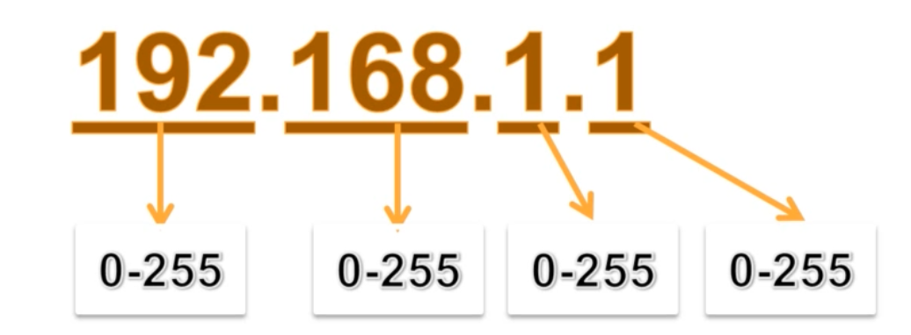

# Nmap

### Uses:

1. Scan Network
2. OS Information
3. Port Information
4. Service Information
5. Firewall Detection

### Working:

1. Ping scanning
2. Port scanning&#x20;
3. Service and version detection
4. OS detection
5. Script Detection
6. Timing - IPS and IDS jumping
7. Scanning large network

### Nmap Subnet Scan:

```bash
nmap 192.168.1.0/24  
```

### Subnet:

Logical sub-division of a network



### Scanning more then one ip

```bash
nmap 192.168.1.64 192.168.1.72 192.168.1.48
```

### Nmap scan from a file (containing ips):

```bash
nmap -iL /Desktop/ip.txt
```

### Nmap random scan :

```bash
nmap 192.168.1.0/24 -iR 50 
#here 50 is the number of ips
```

### Nmap scan to exclude some ips

```bash
#for some number of ips
nmap 192.168.1.0/24 --exclude 192.168.1.25 192.168.1.64

#for list of ips from file
nmap 192.168.1.0/24 --excludefile /Desktop/ip.txt
```

### Storing Nmap Result

```bash
nmap 192.168.1.64 /Desktop/result.txt
```



```bash
nmap 192.168.1.64 -oN /Desktop/result.txt
```



```
nmap 192.168.1.64 -oX /Desktop/result.xml
```



```bash
nmap 192.168.1.64 -oG /Desktop/result.txt
```



```bash
nmap 192.168.1.64 -oA /Desktop/result
```


